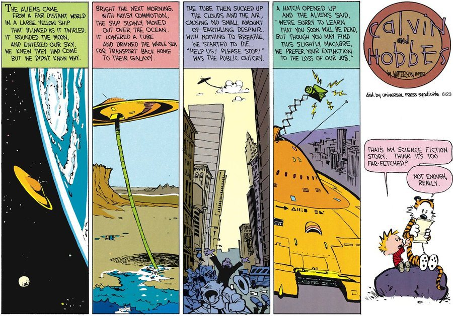

~~ work in progress ~~
---

Speculative Futures explores past future narratives, like that of Ursula K. Le Guin, and past attempts at technological utopia, like Chile's Cybersyn. In both cases, we will examine what shortcomings prevented these from being fully realized, how these visions may have been limited or exclusionary, and consider how things are different now. We will tie these to the contemporary technological issues through forward-looking readings like the Xenofeminism manifesto and Inventing the Future. The goal is for students to envision their own utopian futures, which consequently involve reimagining current circumstances, and have them write about and prototype the technologies that undergird these fictions.

---

---

10 weeks

(these weeks aren't in a particular order at the moment)

- Week 1: What do we have to look forward to? A whirlwind tour of the imagined and present dystopia
    - to start: what is utopia? how would you define it?
    - readings:
        - Brave New World, Aldous Huxley
        - climate change, racial and gender inequality, wealth disparity
        - psychopass/sesame credit
    - [When the Messiah Came to America, She Was a Woman](https://blog.longreads.com/2016/02/25/when-the-messiah-came-to-america-she-was-a-woman/). Chris Jennings.
    - "the future is here, it's just unevenly distributed" - gibson
    - [Why Futurism Has a Cultural Blindspot](http://nautil.us/issue/28/2050/why-futurism-has-a-cultural-blindspot). Tom Vanderbilt.
    - [The Unexotic Underclass](https://miter.mit.edu/the-unexotic-underclass/). C.Z. Nnaemeka.
    - [Make technological utopia easier with this one weird trick](http://futurismic.com/2014/10/12/make-technological-utopia-easier-with-this-one-weird-trick/). Paul Raven.
    - [Social Science Fiction](http://www.peterfrase.com/2010/12/social-science-fiction/). Peter Frase.
    - [A Non-Euclidean View of California as a Cold Place to Be](http://theanarchistlibrary.org/library/ursula-k-le-guin-a-non-euclidean-view-of-california-as-a-cold-place-to-be). Ursula K. Le Guin.
    - [Postcards from the Futch](https://medium.com/message/postcards-from-the-futch-595796d8a45d#.7x8g0skdj). Joanne McNeil.
    - [Optimists’ Creed: Brave New Cyberlearning, Evolving Utopias (Circa 2041)](http://link.springer.com/article/10.1007/s40593-016-0096-x). Winslow Burleson, Armanda Lewis.
    - [Free love or genocide? The trouble with Utopias](http://www.theguardian.com/books/2016/jan/24/trouble-with-utopia-free-love-genocide-thomas-more-500-exhibition). Tobias Jones.
    - [Every Single Word Spoken by a Person of Color in "Her"](https://www.youtube.com/watch?v=wy_z_KKClBE)
    - [The Future Mundane](http://www.core77.com/posts/25678/the-future-mundane-25678). Nick Foster.

- Week 1.5?: The Illusive Utopia: Cultural Hegemony and Ideology
    - [In the Name of Love](https://www.jacobinmag.com/2014/01/in-the-name-of-love/). Miya Tokumitsu.
    - ["Sharing" Economy and Self-Exploitation](http://thenewinquiry.com/blogs/marginal-utility/sharing-economy-and-self-exploitation/). Rob Horning.

- Week 2: Gender and Sexuality
    - [Why Aren't There More Women Futurists?](http://www.theatlantic.com/technology/archive/2015/07/futurism-sexism-men/400097/) Rose Eveleth.
    - [A Cyborg Manifesto](http://faculty.georgetown.edu/irvinem/theory/Haraway-CyborgManifesto-1.pdf). Donna Haraway.
    - [Xenofeminism: A Politics for Alienation](http://www.laboriacuboniks.net/). Laboria Cuboniks.
    - [The Matter of Seggri](http://poliscifi.pbworks.com/f/leguin.pdf). Ursula K. Le Guin.
    - [Aye, and Gomorrah...](http://strangehorizons.com/2015/20151123/2delany-f.shtml). Samuel R. Delany.
    - [So far we have discovered fourteen genders](https://twitter.com/MicroSFF/status/720991032079462401). @MicroSFF
    - [Technically, a Utopia](http://bookforum.com/inprint/022_05/15583). Sarah Leonard.

- Week 3: Who produces the future? Neocolonialism
    - [Postcapitalist Ecology: A Comment on Inventing the Future](http://thedisorderofthings.com/2015/11/04/postcapitalist-ecology-a-comment-on-inventing-the-future/). Joseph Kay.
    - [E-waste Republic](http://interactive.aljazeera.com/aje/2015/ewaste/index.html). Jacopo Ottaviani & Isacco Chiaf.
    - [Beyond “Conflict Minerals”: The Congo’s Resource Curse Lives On](https://www.dissentmagazine.org/article/beyond-conflict-minerals-the-congos-resource-curse-lives-on). Colin Kinniburgh.
    - [The Laborers Who Keep Dick Pics and Beheadings Out of Your Facebook Feed](http://www.wired.com/2014/10/content-moderation). Adrian Chen.
    - [1 Million Workers. 90 Million iPhones. 17 Suicides. Who’s to Blame?](http://www.wired.com/2011/02/ff_joelinchina/). Joel Johnson.
    - [Congratulations, We’re Moving Your Department to Tennessee](https://backchannel.com/those-entry-level-startup-jobs-they-re-now-mostly-dead-ends-in-the-boondocks-af3b4066f5dd#.gmwwi6lh0). Lauren Smiley.
    - [The Ones Who Walk Away From Omelas](http://engl210-deykute.wikispaces.umb.edu/file/view/omelas.pdf). Ursula K. Le Guin.

- Week 4: The Visible Hand: Economies
    - topics:
        - algorithmic planning
        - societies where technology does not change, but the social relations around it do
    - [The Cybersyn Revolution](https://www.jacobinmag.com/2015/04/allende-chile-beer-medina-cybersyn/). Eden Medina.
    - [Red plenty: lessons from the Soviet dream](http://www.theguardian.com/books/2010/aug/07/red-plenty-francis-spufford-ussr). Francis Spufford.
    - [What Wal-Mart Knows About Customers' Habits](http://www.nytimes.com/2004/11/14/business/yourmoney/what-walmart-knows-about-customers-habits.html). Constance L. Hays.
    - [A Few Notes on the Culture](http://www.vavatch.co.uk/books/banks/cultnote.htm). Iain M Banks.
    - [How Far to AI-topia?](http://www.milesbrundage.com/blog-posts/how-far-to-ai-topia). Miles Brundage.

- Week 5: Positive Freedom: The Post-Work Society
    - [Justice for “Data Janitors”](http://www.publicbooks.org//nonfiction/justice-for-data-janitors). Lilly Irani.
    - [The Dialectic of Technology](https://www.jacobinmag.com/2012/02/the-dialectic-of-technology/). Peter Frase.
    - [The Workers Who Bring You Black Friday](http://www.thenation.com/article/holiday-crush/). Gabriel Thompson.

- Week 6: (Intellectual) Property: State and Legislation
    - [Welcome to Life: the singularity, ruined by lawyers](https://www.youtube.com/watch?v=IFe9wiDfb0E). Tom Scott.
    - [Four Futures](https://www.jacobinmag.com/2011/12/four-futures/). Peter Frase.

- Week 7: Postwestern Society
    - [Mono no aware](http://www.lightspeedmagazine.com/fiction/mono-no-aware/). Ken Liu.
    - [Tongtong's Summer](http://clarkesworldmagazine.com/xia_12_14_reprint/). Xia Jia (translated by Ken Liu).

- Week 8: Sapir-Whorf: Language
    - [Shaka, When the Walls Fell](http://www.theatlantic.com/entertainment/archive/2014/06/star-trek-tng-and-the-limits-of-language-shaka-when-the-walls-fell/372107/). Ian Bogost.
        - (watch the episode too)
    - The Dispossessed. Ursula K. Le Guin.
        - (selections around Pravic)

- Week 9: Chaff: Internet and (Social) Media
    - topic: the internet and mass connectivity was heralded as a panacea for the challenges of democratic political participation - what happened?
    - [SPOOKS](http://www.amazon.com/SPOOKS-dystopia-E-M-Quangel-ebook/dp/B00QL15GH4), by EM Quangel
    - [Communicative Capitalism: Circulation and the Foreclosure of Politics](https://commonconf.files.wordpress.com/2010/09/proofs-of-tech-fetish.pdf). Jodi Dean.

- Week 10: All We Have: Environment & Ecology
    - [Alive in the Sunshine](https://www.jacobinmag.com/2014/01/alive-in-the-sunshine/). Alyssa Battistoni.

- Week 11??: Come down
    - [Everything is Broken](https://medium.com/message/everything-is-broken-81e5f33a24e1#.oef7thyw0). Quinn Norton.
    - [Fully automated luxury communism: a utopian critique](https://libcom.org/blog/fully-automated-luxury-communism-utopian-critique-14062015). mcm\_cmc.

---

- <http://library.uniteddiversity.coop/More_Books_and_Reports/The_Culture_Novels-Iain_M_Bainks-Anarchist_Science_Fiction/iain%20m%20banks%20-%201989%20-%20the%20state%20of%20the%20art/Iain%20M.%20Banks%20-%20The%20State%20of%20the%20Art%20v1.html>
- The Futurological Congress. Stanisław Lem.

to check out:
- Trouble on Triton. Samuel R. Delany.
- The Left Hand of Darkness. Ursula K. Le Guin.
- China Mountain Zhang. Maureen F. McHugh.
- Stories of Your Life and Others. Ted Chiang.
- Lilith's Brood. Octavia E. Butler.
- Down and Out in the Magic Kingdom. Cory Doctorow.
- Martian Chronicles. Ray Bradbury.
- V for Vendetta. Alan Moore.
- Stranger in a Strange Land. Robert A. Heinlein.
- Never Let Me Go. Kazuo Ishiguro.
- Snow Crash. Neal Stephenson.
- The Third Wave. Alvin Toffler.
- Pacific Edge. Kim Stanley Robinson.
- For Us, The Living: A Comedy of Customs. Robert A. Heinlein.
- Ecotopia. Ernest Callenbach.
- Embassytown. China Miéville.
- The Sandman. ETA Hoffmann.
- The Handmaid's Tale. Margaret Atwood.

also see: <https://docs.google.com/document/d/13-nu88sfg0mDgbpKyJHpU6Q7tK9PJTTScaaOyeGplqM/edit>

also refer to:

- <http://www.milesbrundage.com/uploads/2/1/6/8/21681226/utopiapaperai.pdf>

also to consider:

- Rebecca Solnit's disaster utopia; the idea of transient utopias vs sustainable ones; <https://www.rochester.edu/in_visible_culture/Issue_16/reviews/johnson/johnson.html>
- political theory? theories of "human nature"? e.g. Leviathan, state of nature, positive vs negative freedoms. maybe beyond the scope of the course
- "end of history", dialectic of enlightenment
- young adult speculative fiction? the perspective of age? growing up?

---

the following were taken from: Allison Burtch's [Critical Theory of Technology](https://github.com/allisonburtch/Critical-Theory-of-Technology)

- [Communicative Capitalism: Circulation and the Foreclosure of Politics](https://commonconf.files.wordpress.com/2010/09/proofs-of-tech-fetish.pdf). Jodi Dean.
- [A Non-Euclidean View of California as a Cold Place to Be](http://theanarchistlibrary.org/library/ursula-k-le-guin-a-non-euclidean-view-of-california-as-a-cold-place-to-be). Ursula K. Le Guin.

the following were taken from Chris Novello's [Computer Utopias](http://chrisnovello.com/teaching/risd/computer-utopias/)

- [Every Single Word Spoken by a Person of Color in "Her"](https://www.youtube.com/watch?v=wy_z_KKClBE)
- [The Future Mundane](http://www.core77.com/posts/25678/the-future-mundane-25678). Nick Foster.
